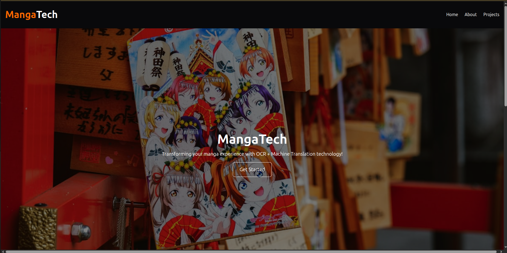

# MangaTech  
This is an application 

## Badges  

  
  

# Table of contents  
1. [Introduction](#introduction)  
2. [Some paragraph](#paragraph1)  
    1. [Sub paragraph](#subparagraph1)  
3. [Another paragraph](#paragraph2)  

## Screenshots  

## Tech Stack  

**Frontend:** React, Vite, TailwindCSS  

**Backend:** FastAPI

**AI model**: EasyOCR, transformers, HuggingFace

## Features  

- Light/dark mode toggle  
- Live previews  
- Fullscreen mode  
- Cross platform 

## Run Locally  

## Environment Variables  

To run this project, you will need to add the following environment variables to your .env file  
`API_KEY`  

`ANOTHER_API_KEY` 

## Acknowledgements  

- [Awesome Readme Templates](https://awesomeopensource.com/project/elangosundar/awesome-README-templates)
- [Awesome README](https://github.com/matiassingers/awesome-readme)
- [How to write a Good readme](https://bulldogjob.com/news/449-how-to-write-a-good-readme-for-your-github-project)

## Feedback  

If you have any feedback, please reach out to us at fake@fake.com

## License  

[MIT](https://choosealicense.com/licenses/mit/)
